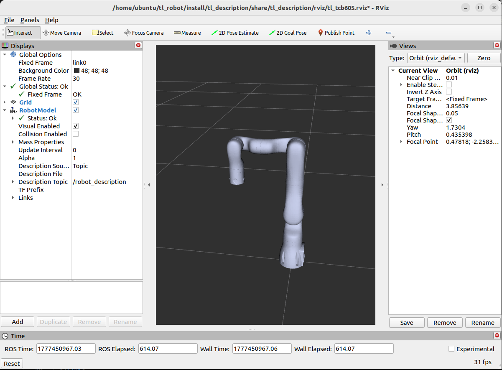

<div align="center">

# 天链机器人tl_bringup使用说明书

</div>

## 目录
* 1.[tl_bringup功能包说明](#tl_bringup功能包说明)
* 2.[tl_bringup功能包使用](#tl_bringup功能包使用)
* 3.[tl_bringup功能包架构说明](#tl_bringup功能包架构说明)
* 4.[tl_bringup功能包话题说明](#tl_bringup功能包话题说明)

## tl_bringup功能包说明
tl_bringup功能包为实现多个launch文件同时运行所设计的功能包，使用该功能包可用一条命令实现多个节点结合的复杂功能的启动。
* 1.功能包使用。
* 2.功能包架构说明。
* 3.功能包话题说明。  
通过这三部分内容的介绍可以帮助大家：
* 1.了解该功能包的使用。
* 2.熟悉功能包中的文件构成及作用。
* 3.熟悉功能包相关的话题，方便开发和使用
## tl_bringup功能包使用
配置环境并完成连接后我们可以通过以下命令直接启动节点，运行tl_bringup功能包，在使用时需要将<arm_type>更换为实际的机械臂型号，可选择的机械臂型号有tcb605、tcb605f、tcb605l、tcb605lv、tcb605v、tcb610、tcb610v、tcb705、tcb705f、tcb705l、tcb705lv、tcb705v、tcb710、tcb710v。
```
ros2 launch tl_bringup tl_<arm_type>_bringup.launch.py
```
例如tcb605机械臂的启动命令:
```
ros2 launch tl_bringup tl_tcb605_bringup.launch.py
```
节点启动成功后，将弹出以下画面，控制真实机械臂时，Rviz2中的机械臂模型会联动:
<div align="center">

  

</div>

## tl_bringup功能包架构说明
### 功能包文件总览
当前tl_bringup功能包的文件构成如下:
```
├── CMakeLists.txt                         # 编译规则文件
├── doc                                    # 辅助文档、图片文件
│   └── tl_bringup.png
├── launch                                 # 启动文件
│   ├── tl_tcb605_bringup.launch.py        # tcb605启动文件
│   ├── tl_tcb605f_bringup.launch.py       # tcb605f启动文件
│   ├── tl_tcb605l_bringup.launch.py       # tcb605l启动文件
│   ├── tl_tcb605lv_bringup.launch.py      # tcb605lv启动文件
│   ├── tl_tcb605v_bringup.launch.py       # tcb605v启动文件
│   ├── tl_tcb610_bringup.launch.py        # tcb610启动文件
│   ├── tl_tcb610v_bringup.launch.py       # tcb610v启动文件
│   ├── tl_tcb705_bringup.launch.py        # tcb705启动文件
│   ├── tl_tcb705f_bringup.launch.py       # tcb705f启动文件
│   ├── tl_tcb705l_bringup.launch.py       # tcb705l启动文件
│   ├── tl_tcb705lv_bringup.launch.py      # tcb705lv启动文件
│   ├── tl_tcb705v_bringup.launch.py       # tcb705v启动文件
│   ├── tl_tcb710_bringup.launch.py        # tcb710启动文件
│   └── tl_tcb710v_bringup.launch.py       # tcb710v启动文件
├── package.xml                            # 依赖说明文件
└── README.md                              # 说明文档
```
## tl_bringup功能包话题说明
该功能包当前并没有本身的话题，主要为调用其他功能包的话题实现。

