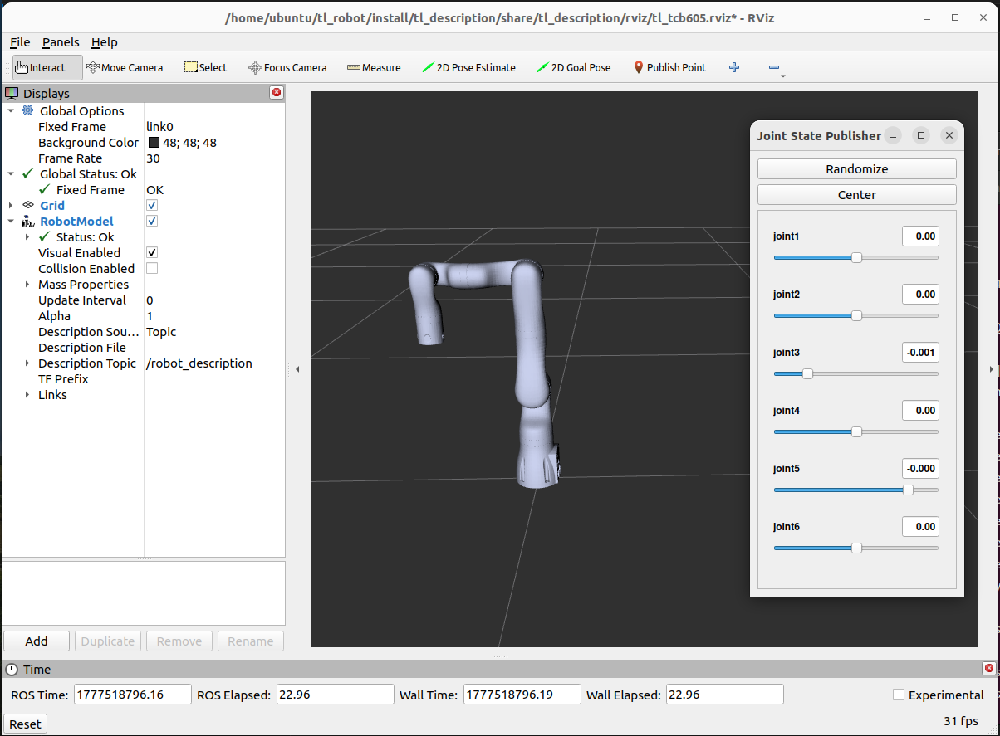

<div align="center">

# 天链机器人tl_description使用说明书

</div>

## 目录
* 1.[tl_description功能包说明](#tl_description功能包说明)
* 2.[tl_description功能包使用](#tl_description功能包使用)
* 3.[tl_description功能包架构说明](#tl_description功能包架构说明)
* 4.[tl_description功能包话题说明](#tl_description功能包话题说明)

## tl_description功能包说明
tl_description功能包为显示机器人模型和TF变换的功能包，通过该功能包，我们可以实现电脑中的虚拟机械臂与现实中的实际机械臂的联动的效果。
* 1.功能包使用。
* 2.功能包架构说明。
* 3.功能包话题说明。
通过这三部分内容的介绍可以帮助大家：
* 1.了解该功能包的使用。
* 2.熟悉功能包中的文件构成及作用。
* 3.熟悉功能包相关的话题，方便开发和使用
## tl_description功能包使用
配置环境后我们可以通过以下命令直接启动节点，运行tl_description功能包，在使用时需要将<arm_type>更换为实际的机械臂型号，可选择的机械臂型号有tcb605、tcb605f、tcb605l、tcb605lv、tcb605v、tcb610、tcb610v、tcb705、tcb705f、tcb705l、tcb705lv、tcb705v、tcb710、tcb710v，<use_sim>选择是否进行仿真控制。
```
ros2 launch tl_description tl_description.launch.py arm_type:=<arm_type> use_sim:=<use_sim>
```
当进行仿真控制时，<use_sim>设置为true，此时/joint_state_publisher_gui节点会发布关节状态话题/joints_states并生成GUI滑动条，通过拖动滑动条可以手动控制每个关节的角度或位置，例如tcb605机械臂的启动命令:
```
ros2 launch tl_description tl_description.launch.py arm_type:=tcb605 use_sim:=true
```
节点启动成功后，将弹出以下画面，通过拖动滑动条可以控制每个关节的角度:
<div align="center">

  

</div>

当进行真实机械臂控制时，<use_sim>设置为false，此时节点需要订阅/joint_states话题计算机器人各连杆的tf变换，否则RViz2中无法正常显示机械臂模型运动，因此需要启动tl_driver功能包提供/joint_states话题输入，首先启动tl_driver功能包:
```
ros2 launch tl_driver tl_driver.launch.py arm_type:=tcb605
```
然后启动tl_driver功能包:
```
ros2 launch tl_description tl_description.launch.py arm_type:=tcb605 use_sim:=false
```
节点启动成功后，控制真实机械臂时，Rviz2中的机械臂模型会进行对应角度的运动。

## tl_description功能包架构说明
## 功能包文件总览
```
├── CMakeLists.txt                           # 编译规则文件
├── doc                                      # 辅助文档、图片文件
│   └── tl_description.png
├── launch                                   # 启动文件
│   └── tl_description.launch.py
├── meshes                                   # 模型文件
│   ├── tl_tcb605                            # tcb605机械臂模型文件
│   │   ├── link0.STL
│   │   ├── link1.STL
│   │   ├── link2.STL
│   │   ├── link3.STL
│   │   ├── link4.STL
│   │   ├── link5.STL
│   │   └── link6.STL
│   ├── tl_tcb605f                           # tcb605f机械臂模型文件
│   │   ├── link0.STL
│   │   ├── link1.STL
│   │   ├── link2.STL
│   │   ├── link3.STL
│   │   ├── link4.STL
│   │   ├── link5.STL
│   │   └── link6.STL
│   ├── tl_tcb605l                           # tcb605l机械臂模型文件
│   │   ├── link0.STL
│   │   ├── link1.STL
│   │   ├── link2.STL
│   │   ├── link3.STL
│   │   ├── link4.STL
│   │   ├── link5.STL
│   │   └── link6.STL
│   ├── tl_tcb605lv                          # tcb605lv机械臂模型文件
│   │   ├── camera_link.STL
│   │   ├── link0.STL
│   │   ├── link1.STL
│   │   ├── link2.STL
│   │   ├── link3.STL
│   │   ├── link4.STL
│   │   ├── link5.STL
│   │   └── link6.STL
│   ├── tl_tcb605v                           # tcb605v机械臂模型文件
│   │   ├── camera_link.STL
│   │   ├── link0.STL
│   │   ├── link1.STL
│   │   ├── link2.STL
│   │   ├── link3.STL
│   │   ├── link4.STL
│   │   ├── link5.STL
│   │   └── link6.STL
│   ├── tl_tcb610                            # tcb610机械臂模型文件
│   │   ├── link0.STL
│   │   ├── link1.STL
│   │   ├── link2.STL
│   │   ├── link3.STL
│   │   ├── link4.STL
│   │   ├── link5.STL
│   │   └── link6.STL
│   ├── tl_tcb610v                           # tcb610v机械臂模型文件
│   │   ├── camera_link.STL
│   │   ├── link0.STL
│   │   ├── link1.STL
│   │   ├── link2.STL
│   │   ├── link3.STL
│   │   ├── link4.STL
│   │   ├── link5.STL
│   │   └── link6.STL
│   ├── tl_tcb705                            # tcb705机械臂模型文件
│   │   ├── link0.STL
│   │   ├── link1.STL
│   │   ├── link2.STL
│   │   ├── link3.STL
│   │   ├── link4.STL
│   │   ├── link5.STL
│   │   ├── link6.STL
│   │   └── link7.STL
│   ├── tl_tcb705f                           # tcb705f机械臂模型文件
│   │   ├── link0.STL
│   │   ├── link1.STL
│   │   ├── link2.STL
│   │   ├── link3.STL
│   │   ├── link4.STL
│   │   ├── link5.STL
│   │   ├── link6.STL
│   │   └── link7.STL
│   ├── tl_tcb705l                           # tcb705l机械臂模型文件
│   │   ├── link0.STL
│   │   ├── link1.STL
│   │   ├── link2.STL
│   │   ├── link3.STL
│   │   ├── link4.STL
│   │   ├── link5.STL
│   │   ├── link6.STL
│   │   └── link7.STL
│   ├── tl_tcb705lv                          # tcb705lv机械臂模型文件
│   │   ├── camera_link.STL
│   │   ├── link0.STL
│   │   ├── link1.STL
│   │   ├── link2.STL
│   │   ├── link3.STL
│   │   ├── link4.STL
│   │   ├── link5.STL
│   │   ├── link6.STL
│   │   └── link7.STL
│   ├── tl_tcb705v                           # tcb705v机械臂模型文件
│   │   ├── camera_link.STL
│   │   ├── link0.STL
│   │   ├── link1.STL
│   │   ├── link2.STL
│   │   ├── link3.STL
│   │   ├── link4.STL
│   │   ├── link5.STL
│   │   ├── link6.STL
│   │   └── link7.STL
│   ├── tl_tcb710                            # tcb710机械臂模型文件
│   │   ├── link0.STL
│   │   ├── link1.STL
│   │   ├── link2.STL
│   │   ├── link3.STL
│   │   ├── link4.STL
│   │   ├── link5.STL
│   │   ├── link6.STL
│   │   └── link7.STL
│   └── tl_tcb710v                           # tcb710v机械臂模型文件
│       ├── camera_link.STL
│       ├── link0.STL
│       ├── link1.STL
│       ├── link2.STL
│       ├── link3.STL
│       ├── link4.STL
│       ├── link5.STL
│       ├── link6.STL
│       └── link7.STL
├── package.xml                              # 依赖说明文件
├── README.md                                # 说明文档
├── rviz                                     # rviz2配置文件
│   ├── tl_tcb605f.rviz
│   ├── tl_tcb605l.rviz
│   ├── tl_tcb605lv.rviz
│   ├── tl_tcb605.rviz
│   ├── tl_tcb605v.rviz
│   ├── tl_tcb610.rviz
│   ├── tl_tcb610v.rviz
│   ├── tl_tcb705f.rviz
│   ├── tl_tcb705l.rviz
│   ├── tl_tcb705lv.rviz
│   ├── tl_tcb705.rviz
│   ├── tl_tcb705v.rviz
│   ├── tl_tcb710.rviz
│   └── tl_tcb710v.rviz
└── urdf                                     # urdf描述文件
    ├── tl_tcb605.csv
    ├── tl_tcb605.urdf                       # tcb605机械臂urdf描述文件
    ├── tl_tcb605f.csv
    ├── tl_tcb605f.urdf                      # tcb605f机械臂urdf描述文件
    ├── tl_tcb605l.csv
    ├── tl_tcb605l.urdf                      # tcb605l机械臂urdf描述文件
    ├── tl_tcb605lv.csv
    ├── tl_tcb605lv.urdf                     # tcb605lv机械臂urdf描述文件
    ├── tl_tcb605v.csv 
    ├── tl_tcb605v.urdf                      # tcb605v机械臂urdf描述文件
    ├── tl_tcb610.csv
    ├── tl_tcb610.urdf                       # tcb610机械臂urdf描述文件     
    ├── tl_tcb610v.csv
    ├── tl_tcb610v.urdf                      # tcb610v机械臂urdf描述文件 
    ├── tl_tcb705.csv
    ├── tl_tcb705.urdf                       # tcb705机械臂urdf描述文件 
    ├── tl_tcb705f.csv
    ├── tl_tcb705f.urdf                      # tcb705f机械臂urdf描述文件
    ├── tl_tcb705l.csv
    ├── tl_tcb705l.urdf                      # tcb705l机械臂urdf描述文件
    ├── tl_tcb705lv.csv
    ├── tl_tcb705lv.urdf                     # tcb705lv机械臂urdf描述文件
    ├── tl_tcb705v.csv
    ├── tl_tcb705v.urdf                      # tcb705c机械臂urdf描述文件
    ├── tl_tcb710.csv
    ├── tl_tcb710.urdf                       # tcb710机械臂urdf描述文件
    ├── tl_tcb710v.csv
    └── tl_tcb710v.urdf                      # tcb710v机械臂urdf描述文件
```
## tl_description功能包话题说明
如下为该功能包的话题说明。  
```
  Subscribers:
    /joint_states: sensor_msgs/msg/JointState
    /parameter_events: rcl_interfaces/msg/ParameterEvent
  Publishers:
    /parameter_events: rcl_interfaces/msg/ParameterEvent
    /robot_description: std_msgs/msg/String
    /rosout: rcl_interfaces/msg/Log
    /tf: tf2_msgs/msg/TFMessage
    /tf_static: tf2_msgs/msg/TFMessage
  Service Servers:
    /robot_state_publisher/describe_parameters: rcl_interfaces/srv/DescribeParameters
    /robot_state_publisher/get_parameter_types: rcl_interfaces/srv/GetParameterTypes
    /robot_state_publisher/get_parameters: rcl_interfaces/srv/GetParameters
    /robot_state_publisher/list_parameters: rcl_interfaces/srv/ListParameters
    /robot_state_publisher/set_parameters: rcl_interfaces/srv/SetParameters
    /robot_state_publisher/set_parameters_atomically: rcl_interfaces/srv/SetParametersAtomically
  Service Clients:

  Action Servers:

  Action Clients:
```
主要关注以下几个话题。
Subscribers:代表其订阅的话题，其中的/joint_states代表机械臂当前的状态，当进行仿真时/joint_state_publisher_gui
会发布该话题， 通过GUI滑动条可以控制机械臂，当控制真实机械臂时，tl_driver功能包运行时会发布该话题，这样Rviz2中的模型就会根据实际的机械臂状态进行运动。
Publishers:代表其当前发布的话题，其最主要发布的话题为/tf和/tf_static，这两个话题描述了机械臂关节与关节之间的坐标变换关系，也就是TF变换。
剩余话题和服务使用场景较少，可自行了解。