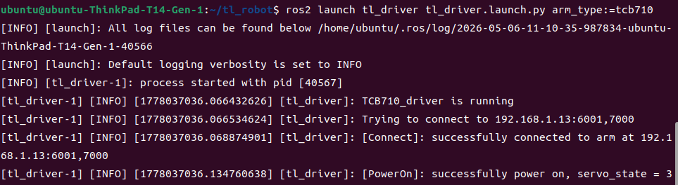
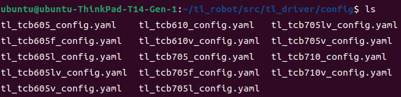
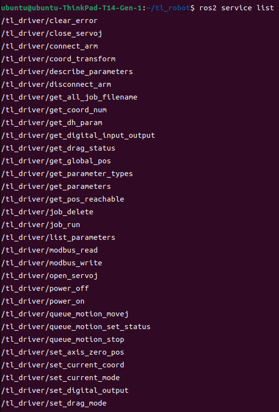
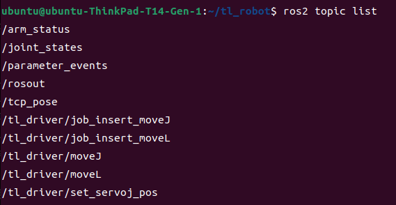

<div align="center">

# 天链机器人tl_driver使用说明书

</div>

## 目录
* 1.[tl_driver功能包说明](#tl_driver功能包说明)
* 2.[tl_driver功能包使用](#tl_driver功能包使用)
* 3.[tl_driver功能包架构说明](#tl_driver功能包架构说明)
* 4.[tl_driver功能包话题与服务说明](#tl_driver功能包话题与服务说明)

## tl_driver功能包说明
tl_driver功能包在机械臂ROS2功能包中是十分重要的，该功能包实现了通过ROS与机械臂进行通信控制机械臂的功能，在下文中将通过以下几个方面详细介绍该功能包。  
* 1.功能包使用。  
* 2.功能包架构说明。  
* 3.功能包话题说明。

通过这三部分内容的介绍可以帮助大家：  
* 1.了解该功能包的使用。  
* 2.熟悉功能包中的文件构成及作用。  
* 3.熟悉功能包相关的话题，方便开发和使用  
## tl_driver功能包使用
### tl_driver功能包编译
在使用该功能包之前需要完成tl_ros2_interface功能包的编译，因为该功能包依赖于tl_ros2_interface功能包
中的自定义msg和srv, 编译完成后接着编译tl_driver功能包,具体操作如下: 
```
cd ~/tl_robot
colcon build --packages-select tl_ros2_interface
source install/setup.bash
colcon build --packages-select tl_driver
```
编译完成后我们可以通过以下命令直接启动节点，连接机械臂。当前的控制基于我们没有改变过机械臂的IP即当前机械臂的IP仍为192.168.1.13。在使用时需要将<arm_type>更换为实际的机械臂型号，可选择的机械臂型号有tcb605、tcb605f、tcb605l、tcb605lv、tcb605v、tcb610、tcb610v、tcb705、tcb705f、tcb705l、tcb705lv、tcb705v、tcb710、tcb710v。
```
ros2 launch tl_driver tl_driver.launch.py arm_type:=<arm_type>
```
启动成功后，将显示以下画面:

  
当机械臂IP被改变后我们的启动指令就失效了，再直接使用如上指令就无法成功连接到机械臂了，我们可以通过修改如下配置文件，重新建立连接。
该配置文件位于我们的tl_driver功能包下的config文件夹下，需要根据不同的机械臂型号修改相应的配置文件。

  
其配置文件内容如下:
```
tl_driver:   
  ros__parameters:  
    #robot param  
    arm_ip: "192.168.1.13"          # 设置TCP连接时的IP  
    arm_port: "6001"                # 设置TCP连接时的端口  
    arm_port_aux: "7000"            # 设置机械臂连接时的辅助端口
    arm_type: "TCB605"              # 机械臂型号
    arm_joints: ["joint1", "joint2", "joint3", "joint4", "joint5", "joint6"] # 关节名称
```
## tl_driver功能包架构说明
### 功能包文件总览
```
├── config                         # 机械臂配置文件
│   ├── tl_tcb605_config.yaml
│   ├── tl_tcb605f_config.yaml
│   ├── tl_tcb605l_config.yaml
│   ├── tl_tcb605lv_config.yaml
│   ├── tl_tcb605v_config.yaml
│   ├── tl_tcb610_config.yaml
│   ├── tl_tcb610v_config.yaml
│   ├── tl_tcb705_config.yaml
│   ├── tl_tcb705f_config.yaml
│   ├── tl_tcb705l_config.yaml
│   ├── tl_tcb705lv_config.yaml
│   ├── tl_tcb705v_config.yaml
│   ├── tl_tcb710_config.yaml
│   └── tl_tcb710v_config.yaml
├── doc                            # 相关文档与图片
│   ├── tl_driver1.png
│   ├── tl_driver2.png
│   ├── tl_driver3.png
│   ├── tl_driver4.png
│   └── tl_driver服务与话题说明书.md
├── launch                         # 启动文件
│   ├── tl_driver.launch.py        # 主启动文件，通过 arm_type 参数选择型号
│   ├── tl_tcb605_driver.launch.py
│   ├── tl_tcb605f_driver.launch.py
│   ├── ...
│   └── tl_tcb710v_driver.launch.py
├── lib                            # API 依赖库源码（构建时复制到 tl_driver/lib/）
│   └── arm/                       # ARM 架构 SWIG 封装库
│       ├── _tl_host.so            #   底层 C 扩展（TCP 通信、机械臂控制）
│       ├── libtl_host.so
│       ├── libmath_wrapper.so     #   数学计算封装（坐标变换等）
│       ├── libmodbus_wrapper.so   #   Modbus 协议封装
│       ├── libservoJ_wrapper.so   #   透传（ServoJ）模式封装
│       └── tl_interface.py        #   Python SWIG 接口
├── package.xml                    # 依赖说明文件
├── README.md                      # 说明文档
├── resource                       # 资源标记文件
│   └── tl_driver
├── setup.cfg                      # Python 包配置文件
├── setup.py                       # Python 编译规则文件
├── tl_driver                      # Python 驱动源代码
│   ├── __init__.py
│   ├── lib/                       # 构建时从lib/arm/ 复制
│   │   ├── _tl_host.so / _nrc_host.so
│   │   └── tl_interface.py
│   └── tl_driver_node.py          # 驱动主节点
└── test                           # 测试脚本
    ├── run_unit_tests.py
    ├── test_job_insert_moveJ.sh
    ├── test_job_insert_moveL.sh
    ├── test_moveJ.sh
    ├── test_moveL.sh
    ├── test_publisher.py
    └── test_topics_and_services.py
```
## tl_driver话题与服务说明
tl_driver的服务和话题较多，可以通过如下指令了解其话题信息。

  
  
主要为套用API实现的一些机械臂本体的功能，其详细介绍和使用在此不详细展开，可以通过专门的文档《[tl_driver服务与话题说明书](doc/tl_driver服务与话题说明书.md)》进行查看。
