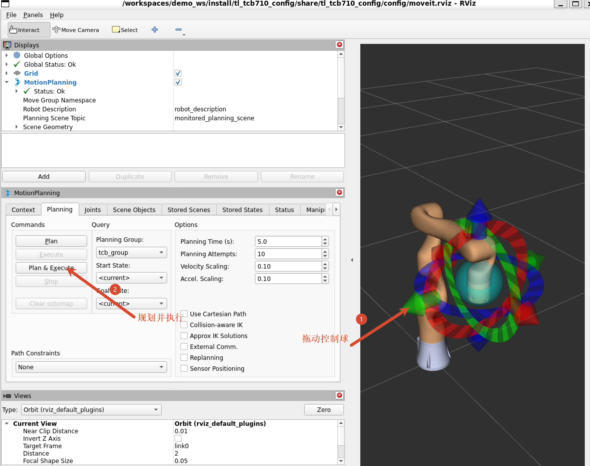
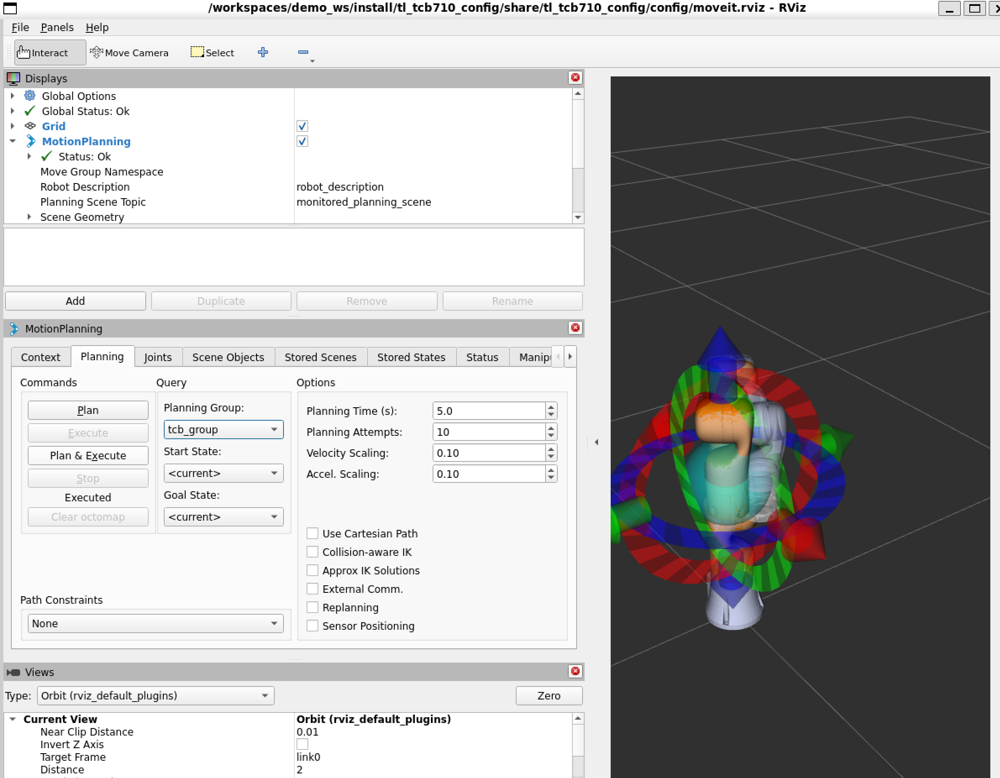

# 天链机器人 tl_moveit2_config 使用说明书

## 目录

- [1. tl_moveit2_config 说明](#1-tl_moveit2_config-说明)
- [2. tl_moveit2_config 使用](#2-tl_moveit2_config-使用)
  - [2.1 MoveIt2 控制虚拟机械臂](#21-moveit2-控制虚拟机械臂)
  - [2.2 MoveIt2 控制真实机械臂](#22-moveit2-控制真实机械臂)
- [3. tl_moveit2_config 架构说明](#3-tl_moveit2_config-架构说明)
  - [3.1 功能包文件总览](#31-功能包文件总览)
- [4. tl_moveit2_config 话题说明](#4-tl_moveit2_config-话题说明)

---

## 1. tl_moveit2_config 说明

`tl_moveit2_config` 功能包集为实现 MoveIt2 控制天链（TianLian）机械臂的功能包集合，其主要作用为调用官方的 MoveIt2 框架，结合 `tl_description` 提供的 URDF 模型，生成适配于天链各型号机械臂的 MoveIt2 配置和启动文件。通过该功能包集可以实现 MoveIt2 控制虚拟机械臂和控制真实机械臂。

目前支持的天链机械臂型号：tcb605、tcb605f、tcb605l、tcb605lv、tcb605v、tcb610、tcb610v、tcb705、tcb705f、tcb705l、tcb705lv、tcb705v、tcb710、tcb710v。

* 1.功能包使用。
* 2.功能包架构说明。
* 3.功能包话题说明。

通过这三部分内容的介绍可以帮助大家：

* 1.了解该功能包集的使用。
* 2.熟悉功能包中的文件构成及作用。
* 3.熟悉功能包相关的话题，方便开发和使用。

---

## 2. tl_moveit2_config 使用

### 2.1 MoveIt2 控制虚拟机械臂

首先配置好环境完成连接后我们可以通过以下命令直接启动节点。

```bash
ros2 launch tl_<arm_type>_config demo.launch.py
```

在实际使用时需要将 `<arm_type>` 更换为实际的机械臂型号，可选的机械臂型号见第 1 节。

例如 tcb710 机械臂的启动命令：

```bash
ros2 launch tl_tcb710_config demo.launch.py
```

节点启动成功后，将显示以下画面。


接下来我们可以通过拖动控制球使机械臂到达目标位置，然后点击规划执行。



规划执行。




### 2.2 MoveIt2 控制真实机械臂

（待实现，后续补充）

---

## 3. tl_moveit2_config 架构说明

### 3.1 功能包文件总览

`tl_moveit2_config` 为 ROS2 功能包集合，由 MoveIt2 Setup Assistant 生成，包含 14 个臂型子功能包。每个子功能包均独立生成且结构一致。

```
tl_moveit2_config/
├── .setup_assistant                    # MoveIt2 Setup Assistant 全局配置
├── README.md                           # 本说明文档
├── tl_tcb605_config/                   # tcb605 机械臂 MoveIt2 配置功能包
│   ├── .setup_assistant                # Setup Assistant 配置记录
│   ├── CMakeLists.txt                  # 编译规则
│   ├── package.xml                     # 包描述文件
│   ├── config/                         # 配置参数文件夹
│   │   ├── initial_positions.yaml      # 初始化位姿（各关节默认角度）
│   │   ├── joint_limits.yaml           # 关节运动限制（速度/加速度/位置）
│   │   ├── kinematics.yaml             # 运动学求解器配置（KDL）
│   │   ├── moveit_controllers.yaml     # MoveIt2 控制器配置
│   │   ├── moveit.rviz                 # RViz2 显示配置文件
│   │   ├── pilz_cartesian_limits.yaml  # Pilz 笛卡尔规划器限制
│   │   ├── ros2_controllers.yaml       # ros2_control 控制器配置
│   │   ├── tl_tcb605.ros2_control.xacro # ros2_control Xacro 描述
│   │   ├── tl_tcb605.srdf              # SRDF（语义机器人描述格式）
│   │   └── tl_tcb605.urdf.xacro        # URDF Xacro 描述（含 ros2_control）
│   └── launch/                         # 启动文件文件夹
│       ├── demo.launch.py              # 虚拟机械臂 MoveIt2 启动文件
│       ├── gazebo_moveit_demo_tcb605.launch.py   # Gazebo 仿真 MoveIt2 启动文件
│       ├── move_group.launch.py        # move_group 启动文件
│       ├── moveit_rviz.launch.py       # RViz2 可视化启动文件
│       ├── rsp.launch.py               # robot_state_publisher 启动文件
│       ├── setup_assistant.launch.py   # Setup Assistant 启动文件
│       ├── spawn_controllers.launch.py # 控制器启动文件
│       ├── static_virtual_joint_tfs.launch.py # 静态虚拟关节 TF 发布
│       └── warehouse_db.launch.py      # warehouse 数据库启动文件
├── tl_tcb605f_config/                  # tcb605f 配置（文件解释参考 tcb605）
├── tl_tcb605l_config/                  # tcb605l 配置（文件解释参考 tcb605）
├── tl_tcb605lv_config/                 # tcb605lv 配置（文件解释参考 tcb605）
├── tl_tcb605v_config/                  # tcb605v 配置（文件解释参考 tcb605）
├── tl_tcb610_config/                   # tcb610 配置（文件解释参考 tcb605）
├── tl_tcb610v_config/                  # tcb610v 配置（文件解释参考 tcb605）
├── tl_tcb705_config/                   # tcb705 配置（文件解释参考 tcb605）
├── tl_tcb705f_config/                  # tcb705f 配置（文件解释参考 tcb605）
├── tl_tcb705l_config/                  # tcb705l 配置（文件解释参考 tcb605）
├── tl_tcb705lv_config/                 # tcb705lv 配置（文件解释参考 tcb605）
├── tl_tcb705v_config/                  # tcb705v 配置（文件解释参考 tcb605）
├── tl_tcb710_config/                   # tcb710 配置（文件解释参考 tcb605，7关节）
├── tl_tcb710v_config/                  # tcb710v 配置（文件解释参考 tcb605，7关节）
└── doc/                                # 文档图片文件夹
    └── ...
```

各子功能包文件作用说明：

| 文件 | 作用 |
|------|------|
| `CMakeLists.txt` | 编译规则 |
| `package.xml` | 包描述文件 |
| `config/initial_positions.yaml` | 初始化位姿 |
| `config/joint_limits.yaml` | 关节限制 |
| `config/kinematics.yaml` | 运动学参数 |
| `config/moveit_controllers.yaml` | MoveIt2 控制器 |
| `config/moveit.rviz` | RViz2 显示配置 |
| `config/pilz_cartesian_limits.yaml` | Pilz 笛卡尔限制 |
| `config/ros2_controllers.yaml` | ros2_control 控制器 |
| `config/<arm>.ros2_control.xacro` | Xacro 描述文件 |
| `config/<arm>.srdf` | MoveIt2 控制配置文件 |
| `config/<arm>.urdf.xacro` | URDF Xacro 描述文件 |
| `launch/demo.launch.py` | 虚拟机械臂 MoveIt2 启动文件 |
| `launch/gazebo_moveit_demo_<arm_type>.launch.py` | Gazebo 仿真 MoveIt2 启动文件，`arm_type` 如 `tcb605`（不含 tl_ 前缀） |
| `launch/move_group.launch.py` | move_group 启动文件 |
| `launch/moveit_rviz.launch.py` | RViz2 可视化启动文件 |
| `launch/rsp.launch.py` | robot_state_publisher 启动文件 |
| `launch/setup_assistant.launch.py` | Setup Assistant 启动文件 |
| `launch/spawn_controllers.launch.py` | 控制器启动文件 |
| `launch/static_virtual_joint_tfs.launch.py` | 静态虚拟关节 TF 发布 |
| `launch/warehouse_db.launch.py` | warehouse 数据库启动文件 |

---

## 4. tl_moveit2_config 话题说明（控制真实机械臂实现之后需修改）

关于 MoveIt2 的话题说明，为使其话题结构更加清晰明白在这里以节点话题的数据流图的方式进行查看和讲解。

在启动以上控制虚拟机器人的节点后可以运行如下指令查看当前话题的对接情况。

```bash
ros2 run rqt_graph rqt_graph
```

运行成功后界面将显示如下画面。


该图反应了当前运行的节点与节点之间的话题通信关系，首先查看 `/tl_driver` 节点，该节点在 MoveIt2 运行时订阅和发布的话题如下。


由图可知，`tl_driver` 发布的 `/joint_states` 话题在持续被 `/robot_state_publisher` 节点和 `/move_group_private` 节点订阅。`/robot_state_publisher` 接收 `/joint_states` 是为了持续发布关节间的 TF 变换；`/move_group_private` 是 MoveIt2 的相关节点，MoveIt2 在规划时也需要实时获取当前机械臂的关节状态信息，所以也订阅了该话题。


MoveIt2 本身涉及的节点有 `move_group`、`move_group_private`、`moveit_simple_controller_manager`，它们的主要作用为实现机械臂的运动规划，并将规划信息等数据显示在 RViz2 中，另一方面还需要将规划数据传递到 ros2_control 端，进行进一步细分。


---

## 常见问题

**Q：如何为现有臂型重新生成 MoveIt2 配置？**

A：使用 MoveIt2 Setup Assistant 打开对应的 SRDF 文件：
```bash
ros2 launch tl_<arm_type>_config setup_assistant.launch.py
```

**Q：如何修改关节速度/加速度限制？**

A：编辑对应臂型的 `config/joint_limits.yaml` 中的 `default_velocity_scaling_factor` 和 `default_acceleration_scaling_factor`，值域 (0, 1.0]。

**Q：启动后 RViz2 中不显示模型？**

A：确保已正确编译工作空间（`colcon build`）并 source `install/setup.bash`。检查 `tl_description` 功能包已正确安装。
